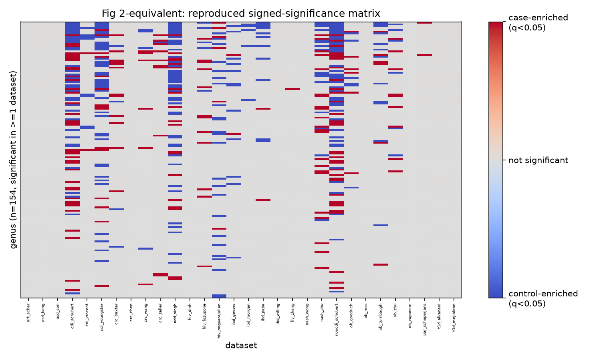
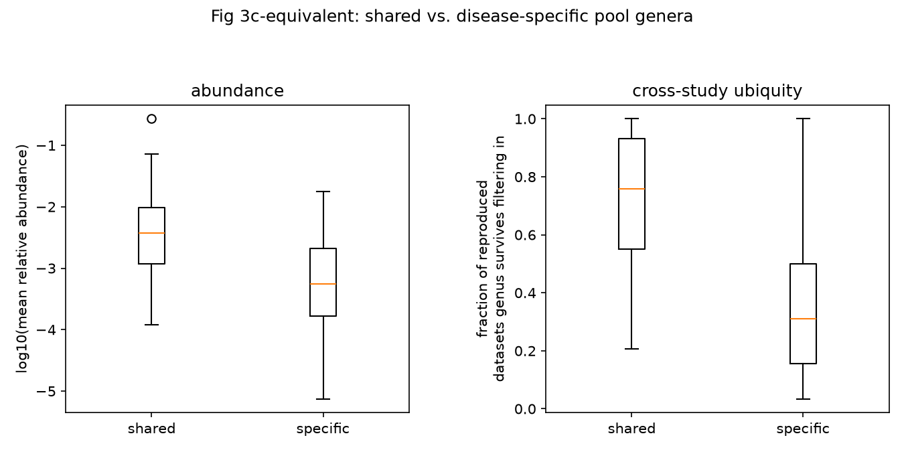

# MicrobiomeHD reproduction

[](https://github.com/pablopsf-eng/microbiomehd-reproduction/actions/workflows/ci.yml)

An independent reproduction of Duvallet et al. (2017), *Nature Communications*,
`10.1038/s41467-017-01973-8` — a meta-analysis of 28 case-control gut microbiome
studies — followed by one extension question.

**Status: M1–M5 complete.** Full reproduction (M1–M3) plus two extensions (M4: a
leave-one-folder-out shared-response classifier and a CLR compositional re-analysis;
M5: batch/study-effect correction for the M4 classifier). See
[`docs/technical-walkthrough.md`](docs/technical-walkthrough.md) for the detail.

**Read next:** [`docs/overview.md`](docs/overview.md) (2-minute summary) or
[`docs/technical-walkthrough.md`](docs/technical-walkthrough.md) (full
file-by-file detail, how everything works and why).

## Results at a glance

| result | number | source |
| --- | --- | --- |
| Table 1 sample counts reconciled exactly | 25 / 30 datasets | [`technical-walkthrough.md`](docs/technical-walkthrough.md) |
| M2 statistics reproduced on the required subset | exact (q-values agree to ~1e-13) | [`reproduction-m2.md`](docs/reproduction-m2.md) |
| M3 "shared disease response" gene list agreement | 97.2% (138/142 lineages) | [`reproduction-m3.md`](docs/reproduction-m3.md) |
| M4/M5 cross-study classifier, leave-one-study-out AUC-ROC | 0.635 → 0.647 with batch correction | [`reproduction-m5.md`](docs/reproduction-m5.md) |

<p>
  
  
</p>

*Left: this project's own reproduced signed-significance matrix (154 genera
significant in ≥1 of 29 datasets; grey = genus absent from that dataset,
not a zero). Right: shared-response genera (n=55) are both more abundant
and more ubiquitous across studies than disease-specific genera (n=99) —
consistent with a shared, non-specific signal rather than disease-specific
noise. Both regenerated by `uv run scripts/figures.py`; full captions and
numbers in [`reproduction-m3.md`](docs/reproduction-m3.md).*

## Data

MicrobiomeHD, Zenodo `10.5281/zenodo.840333`, plus the paper's own supplementary
data files (GitHub). Neither is committed; both are fetched and checksum-verified
by `scripts/download.py`.

## How to run

```bash
uv sync
uv run scripts/download.py        # fetches + checksum-verifies all 31 study
                                   # archives (143 MB) plus the paper's 5
                                   # GitHub-hosted supplementary files into
                                   # data/raw/, and extracts only the files
                                   # this project reads (~850 MB extracted)
uv run pytest -q                  # data-dependent tests run for real once
                                   # the above has completed; otherwise skip
```

### The full pipeline, one command

```bash
uv run snakemake --cores all
```

Downloads the archive (if not already present), computes per-genus
differential abundance for all 30 analysed datasets, reproduces the paper's
shared-response ("non-specific genera") result from this project's own
q-values, and generates the in-scope figure equivalents. Outputs land in
`results/` (gitignored, regenerable): `results/reproduction_all/`,
`results/shared_response/`, `results/figures/`. `uv run snakemake -n` dry-runs
the whole DAG (no network, no data needed) to check the workflow's structure.

Network access is required while this actually runs (the download step
talks to Zenodo), not before. A dataset with a documented, expected failure
(e.g. `ob_zupancic`) does not stop the run; it is recorded, not silently
dropped. See [`docs/reproduction-m3.md`](docs/reproduction-m3.md) for the
numbers this run should reproduce.

### Docker

```bash
docker build -t mbhd .
docker run --rm -v "$(pwd)/data:/app/data" -v "$(pwd)/results:/app/results" mbhd
```

Multi-stage, pinned Python and `uv` versions (see `Dockerfile`). Network
access is required at container *run* time (the same download step above),
not at build time.

See [`docs/technical-walkthrough.md`](docs/technical-walkthrough.md) for the
archive format, known data quirks, and the Table 1 reconciliation results.

### M4/M5 extensions (manual, not part of the Snakemake DAG)

```bash
uv run scripts/clr_shared_response.py   # does a CLR transform change the
                                         # shared-response labels vs. M3's
                                         # committed Euclidean result?
uv run scripts/clr_tie_investigation.py # does CLR's zero-replacement drive
                                         # that change via less-conservative
                                         # tie correction, as first guessed?
uv run scripts/classifier.py            # does a classifier trained on the
                                         # shared-response genus signature
                                         # generalize to an unseen study
                                         # (leave-one-folder-out CV)?
uv run scripts/classifier.py --features clr --batch-correct
                                         # M5: does batch/study-effect
                                         # correction (ComBat) improve the
                                         # M4 classifier further?
```

All require `data/raw/` already downloaded (`scripts/download.py`).
None has a published number to check against — see
[`docs/reproduction-m4.md`](docs/reproduction-m4.md) and
[`docs/reproduction-m5.md`](docs/reproduction-m5.md) for the full results
and how each was verified without one. `scripts/classifier.py` takes
several minutes (200 permutation-null repeats by default; `--n-repeats` to
change it). Outputs land in `results/clr_shared_response/`,
`results/clr_tie_investigation/`, and `results/classifier/` (gitignored,
regenerable).

## Licence

This repository's **code** is MIT-licensed (see [`LICENSE`](LICENSE)). No
MicrobiomeHD data or the paper's supplementary files are committed or
redistributed here — they're fetched at run time under their own terms:
Zenodo record 840333 is CC BY-NC 4.0; the GitHub-hosted supplementary
files carry no published licence (treated as all rights reserved). Table
1-derived fixtures in `tests/data/` are committed under the paper's own
CC BY 4.0 licence, with attribution (Duvallet et al. 2017).
